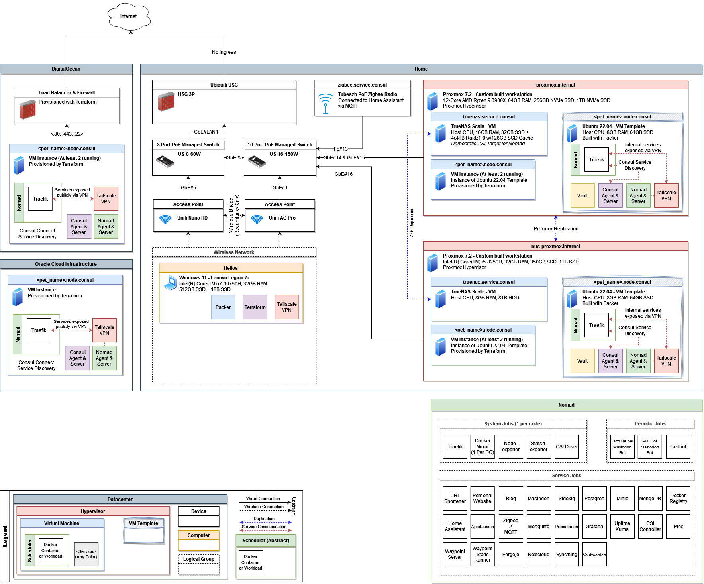

# Demophoon's Infrastructure

This repo is for showcasing the automation that goes into my personal home lab.

I'll be releasing code into here as secrets are gradually removed from the lab
and put into Vault or the environments in which this code is intended to be
ran.

## Reference Diagram

## How to use

Although this repo is public, it is not created to be ran from any starting
state. Treat this repository as inspiration for what I've accomplished and what
is possible and not for a starting off point for your own home lab. I make no
guarantees that the code here will work in your environment although I will do
my best to make everything here reproducible with minimal setup for those
very adventurous few.

### Prerequisites

- Terraform
- Tailscale Account
- Proxmox Server
- TrueNAS Server
- Consul cluster
- Vault

Not used publicly yet but documented for posterity.

- Packer
- Nomad Cluster
- DigitalOcean Account
- Google Cloud Service Account (For managing DNS)
